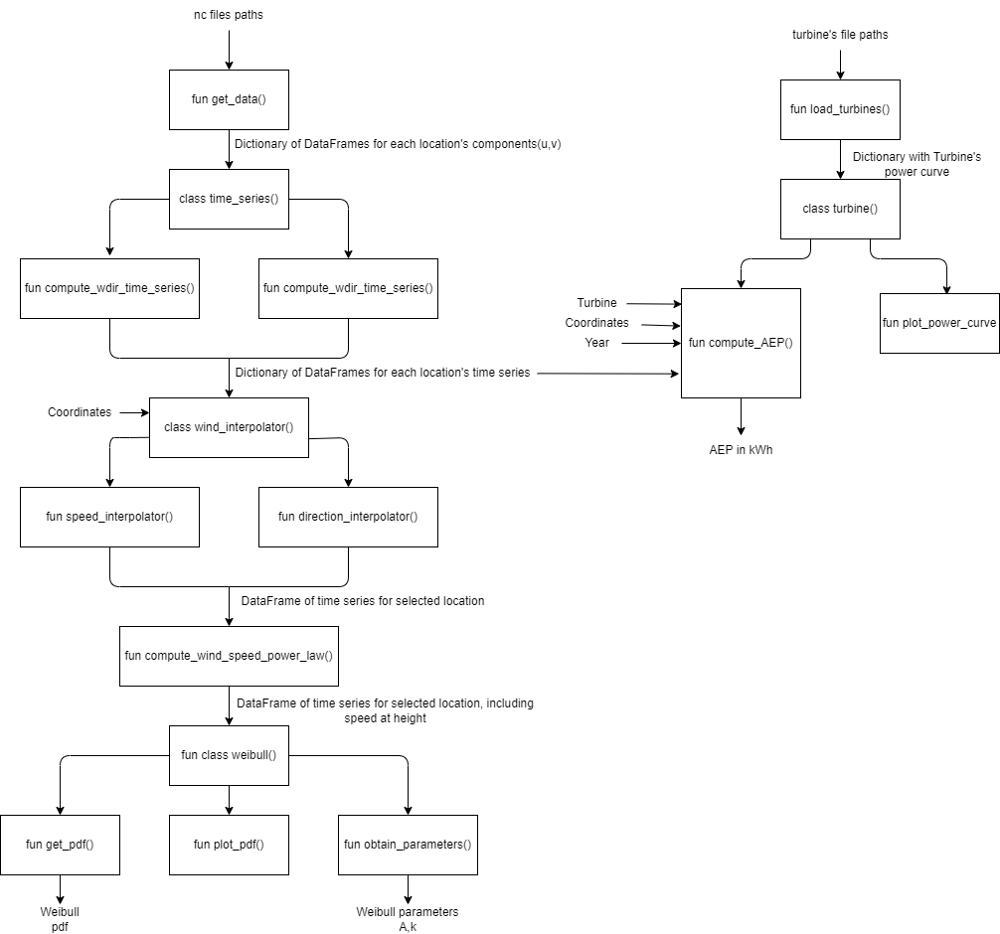

# README

Team: WindWise

Package name: Wind_Re

# OVERVIEW

Wind_Re is a powerful package to carry out wind resource assessments. Being the input wind component (u,v) time series at two heights for 4 locations and the turbine's power curve, it is capable of, in addition to other intermediate steps, compute the AEP for any location within the area formed by the 4 locations, for any selected year given in the input.

These additional features include the computation of the wind speed and time series at any height and location, generating he Weibull fit, or plotting the wind turbine's power curve.

A step by step guide of the installation, as well as description and usage of the functions and classes is provided below.

# Installation instructions

A brief guide on how to install the package and run the demo is mentioned here_

1. Open the repository.
2. Install the Wind_Re package by means of the pyproject.toml file provided in this very same repository.

        pip install -e .

3. Confirm installation of package and dependencies.

        pip list

    Look for "Wind_Re" and "xarray", "netCDF4", "h5netcdf", "scipy", "pandas", "matplotlib", "numpy"

4. Main contains a demonstration of the package, run main.py. It should print the weibull parameters for the conditions selected, as well as the AEP for the same conditions, as well as saving 4 figures in the outputs folder.

5. Explore the code!

# Package architecture

### Architecture Overview

The architecture is divided into two main workflows: **Wind Data Processing** and **Turbine Data Processing**. These workflows are integrated to compute the Annual Energy Production (AEP) for wind turbines.

#### 1. Wind Data Processing

- **Data Input**: Begins with NetCDF files containing wind data.
- **Data Retrieval**: Extracts wind data components (u, v) and organizes them into time series.
- **Time Series Processing**: Computes wind direction and speed time series.
- **Wind Interpolation**: Interpolates wind speed and direction data to specific coordinates.
- **Wind Speed Calculation**: Computes wind speed at a specific height using the power law.
- **Weibull Distribution Analysis**: Analyzes the wind speed data to fit a Weibull distribution, obtaining parameters and plotting the PDF.

#### 2. Turbine Data Processing

- **Data Input**: Begins with turbine data files containing power curve information.
- **Turbine Data Loading**: Loads turbine-specific data, including the power curve.
- **AEP Computation**: Integrates wind time series data and turbine data to compute the Annual Energy Production (AEP) in kWh.
- **Power Curve Plotting**: Plots the power curve of the turbine for visualization.

### Integration Points

- The wind data processing and turbine data processing workflows converge at the AEP computation stage, where wind time series data and turbine-specific data are used to calculate the energy production.
- Wind interpolation and Weibull distribution analysis provide essential inputs for accurate AEP computation.

### Outputs

- **Weibull Parameters**: Parameters of the Weibull distribution (A, k).
- **AEP in kWh**: Annual Energy Production in kilowatt-hours.
- **Visualizations**: Plots of the Weibull PDF and turbine power curve.

### Summary

The architecture is designed to systematically process wind data and turbine data, integrating them to compute the Annual Energy Production (AEP) for wind turbines. It ensures accurate and efficient computation by leveraging wind interpolation and Weibull distribution analysis, providing both numerical outputs and visualizations for better understanding and validation.

# Functions and clasess descriptions

## Functions

**load_netcfd_to_dataframe(file_path)**

Takes *file_path* to the .nc file that you want to load into a DataFrame, which stores the data as it is in the netcfd file.

**collect_nc_files(folder_path)**

Given the *folder_path* to the folder where the .nc files are stored, the function retrieves all the paths to the .nc files in the desired folder. Returns list of paths.

**get_data(directory)**

Being *directory* the path to all .nc files, loads the data using *load_netcfd_to_datagrame()*, extracts the coordinates of the 4 locations, and creates a dictionary containing a DataFrame for each of the 4 locations. The stored time series is the result of the concatenation of all years for each location in each of the .nc files. Returns the mentioned dictionary.

**compute_wind_speed_power_law(wind_data, height, wd_ts_f)**

For the given wind speed time series in the *wind_data* DataFrame for a single location, inserts a column containing the wind speed at the given *height*, with the name *ws_pl_{height}m*. A column with the computed shear exponent is included as well, called *alpha*. The *wd_ts_f* is the *time_series* object, used to know which columns to look into, as well as obtaining the respective heights.

**plot_wind_speed_year(wind_data, wd_ts_f, year, lat, lon, height)**

[EXTRA FUNCTION]

Given the *wind_data* dictionary containing the time series for each location, some coordinates *lat* and *lon*, and the desired year and height, it returns a plot of the time series for the described condition using the *wind_interpolator* class and the *compute_wind_speed_power_law()* function.. The *wd_ts_f* is the *time_series* object, used to know which columns to look into, as well as obtaining the respective heights. The plot is saved under the name *wind_speed_{lat}_{lon}_{height}m_{year}.png*.

**gamma_func(k, mu_1, mu_2)**

Auxilliary function for weibull.

**obtain_wind_rose(wd, x, y, height, wd_ts_f, n_sector=12)**

Given the *wd* DataFrame containing wind data, coordinates *x* and *y*, and the desired *height*, this function generates a wind rose plot. The *wd_ts_f* is the *time_series* object, used to know which columns to look into, as well as obtaining the respective heights. The function first interpolates the wind direction data at the specified coordinates and height. It then divides the wind direction into *n_sector* bins (default is 12) and calculates the probability of wind occurrence in each sector. Finally, it plots the wind rose using a polar projection, with the north direction at the top, and saves the plot as an image file named "windrose.png" in the specified output directory.

**load_turbines(filepath)**

Given the path *file_path* to the .csv files containing the wind turbines data, it creates a dictionary containing the power and CT curve for each of the turbines, where each turbine is stored in a separate DataFrame. It returns the dictionary.

## Classess

### time_series(self, wind_data, u_1, v_1, height_1, u_2, v_2, height_2)

This class is used to transform from the wind components u and v to wind speed and wind direction. The inputs are the dictionary *wind_data* containing the timeseries for each of the locations, as well as the name of the column names, *u_1*, *v_1*, *u_2*, *v_2* containing the components, and the heights at which they are measured, *height_1* and *height_2*.

**compute_ws_time_series(self, cords)**

For the given *cords*, it computes the windspeed time series at the two available and stated heights in the object declaration. It does so by means of the following equation.

$ws = \sqrt{u^2 + v^2}$

The coordinates must be one of the 4 initial coordinates. It returns the dictionary, in which the DataFrame corresponding to the coordinates has an additional column per height, containing the wind speed time series.

**compute_wdir_time_series(self, cords)**

For the given *cords*, it computes the wind direction time series at the two available and stated heights in the object declaration. It does so by means of the following equation, which is adjusted to give wind directions between 0 and 360 degrees.

$wdir = \arctan{(-u, -v)}$

The coordinates must be one of the 4 initial coordinates. It returns the dictionary, in which the DataFrame corresponding to the coordinates has an additional column per height, containing the wind direction time series.

### wind_interpolation(wind_data)

This class aims to compute the wind speed and direction time series for any of the locations wihtin the square formed by the 4 locations. The input is the wind data time series obtained by means of the time_series class.

**speed_interpolator(self, x_coord, y_coord)**

For the *x_coords* and *y_coord*, it obtains the interpolated wind speed time series for both available heights, by means of a bilinear interpolation. It returns a DataFrame, containing the time wind speed timeseries for the new location at the two given heights.

**direction_interpolator(slef, x_coord, y_coord)**

For the *x_coords* and *y_coord*, it obtains the interpolated wind direction time series for both available heights, by means of a bilinear interpolation. It returns a DataFrame, containing the time wind direction timeseries for the new location at the two given heights.

### weibull(self, x, y, height, wind_data_processed, wd_ts_f)

Class used to weibull distribution related actions. The input is the coordinates *x* and *y* and *height* where you will want the weibull fit to be carried out, as well as the *wind_data_processed* coming from the *time_series* object, and the *time_series* object itself, used to know which columns to look into, as well as obtaining the respective heights.

**obtain_parameters(self)**

From the data input into the object declaration, it obtains the weibull paramters A and K for the distributions, using the first and second moments method. The time series for the selected location and height is obtained by means of the *wind_interpolation* class and the *compute_wind_speed_power_law()* function It returns the both parameters.

**get_pdf(self, u_max=25, u_min=0)**

From the data input into the object declaration, after obtaining the parameters using *obtain_parameters()*, it obtains the weibull distribution and returns the probability density function, being the max and min wind speed that indicated in *u_min* and *u_max*.

**plot_pdf(self, u_max=25, u_min=0)**

From the data input into the object declaration, it first computes the time series for the desired location and height, for it to do the histogram. For the weibull curve, it uses the *get_pdf()* function. Both plots are made into one figure, and save in the outputs folder under the name *weibull_pdf.png*.

### turbine(turbine_data, hub_heights)

This class is used to obtain the AEP and the information related with the wind turbines. The input is the *turbine_data* dictionary coming form the input .csv and loaded by means of the *load_turbines()* function. Hub heights of the wind turines has to be input as well.

**compute_AEP(self, turbine_name, lat, lon, wind_data, year, ts_object)**

For the specified *turbine_name*, *lat*, *lon*, and *year*, it returns the AEP under those conditions. It first uses the *weibull* object to obtain the weibull distribution for the specified conditions, to then use the adjusted power curve to obtain the AEP in kWh.

**plot_power_curve(self, turbine_name)**

[EXTRA FUNCTION]

Plots the selected *turbine_name* power curve and saves it in the output folder under the name *ower_curve_{turbine}.png*.

# Collaboration and git work flow

Our team is made of only two members, therefore the team collaboraion and coordination has been easy and simple. Most of the work on this assignment has been made together, meeting to work on it at the same time. Every time we made changes on the code, we created them in a branch with the name of the person who was in charge of coding that day, although it was both of us discussing the next steps. When the changes were verified, they were merged into branch through a pull request.

For some days, we worked separately, trying to make them match with times in which the other member was not working, in order to avoid merge conflicts, once again, in a branch with our respective names. When changes were ready to merge into the main branch, a pull request was opened for the other person to review and accept when they were available.

We have tried to make the commit comments as descrptive and clear as possible, so that tracking last changes could be easily done. This was useful enough to see what the other person had been working on, as well as go back and check some files we had deleted.

